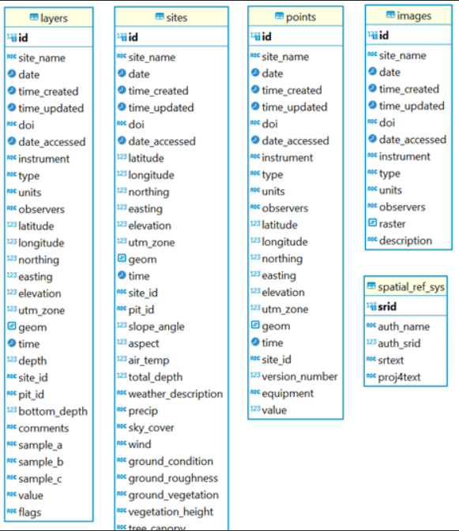
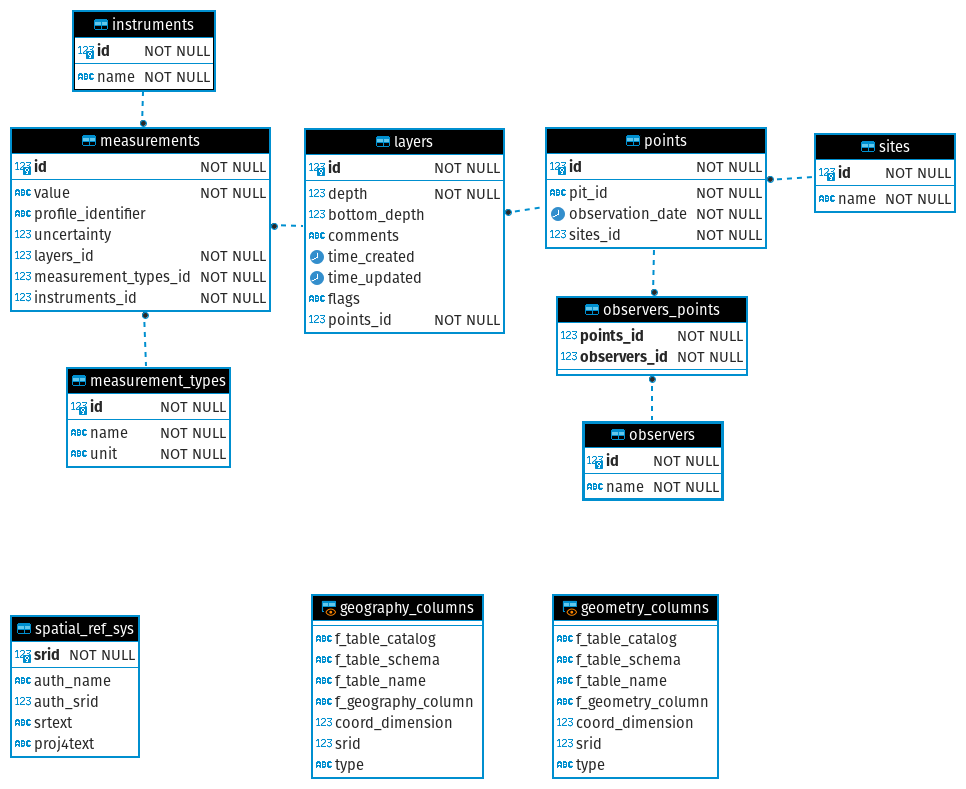

# DB-Re-Structure
Slack channel: DBRS

## Project Title and Introduction

### Collaborators

| Name | Personal goals | Can help with | Role |
| ------------- | ------------- | ------------- | ------------- |
| [Anthony Arendt](https://github.com/aaarendt) | Learn more about how to improve the structure of a relational database  | Experience with SQL queries and using Python and Geopandas for database interfaces | Project Lead |
| [Joe Meyer](https://github.com/jomey) | Make SnowEx data easier and faster to access | DB design, Software Development | Project Lead |
| [James Maze](https://github.com/jtmaze) | To learn more about PostgreSQL, relational databases, PostGIS, and SnowEx data in Alaska! | An outside (fresh) perspective on SnowEx data. Background organizing dissimilar datasets in intuitive ways. | Participant |
| [Ally Detre](https://github.com/allydetre) | Learn more about relational database structure, increase proficiency in Python | Wrangling large dataframes, communication and collaboration with other groups/teams | Participant |
| [Ibrahim Alabi](https://github.com/Ibrahim-Ola) | Explore relationships and foreign keys in relational databases | Python, Table Creation in SQLalchemy | Participant/Coder😎 |
| [Micah Johnson](https://github.com/micahjohnson150) | Explore Potential Improvements, Learn about foregin keys | python, db queries                                                | Coder        |
| [Micah Sandusky](https://github.com/micah-prime/micah-prime.github.io) | Learn more about database structure. Find cool new tools               | Python, git, cloud stuff                                                           | Punching keys |

### The problem
This project aims to accelerate seasonal snow science discoveries using data from the 7-year NASA SnowEx Mission (2017-2023) by reducing technical data access challenges and expanding data accessibility. During the past Hackweek, the Snow Ex DB enabled new research by allowing efficient integration of data across platforms. However, the event participants identified challenges with slow data access times and a steep learning curve for discovering data. This project will address the identified challenges by redesigning the database schema to conform with industry database standards, increasing performance and robustness.

## Data and Methods

### Data
All published [SnowEx datasets at the NSIDC](https://nsidc.org/data/snowex/data).

### Existing methods
With the initial prototype design, the database layout holds as much information within central tables and thus maximizes data retrieval with a single query. However, this design principle was identified as a major contributing factor to the slow query times during increased database traffic during the workshops.

### Proposed methods/tools
Best practices from the industry (Chen, 1976) established a different design, where information gets broken up into multiple tables to increase data integrity, durability, and consistency.

#### Example
As a specific SnowEx DB example, the current design holds the location information with every measurement entry in one table. The improvement to this is creating two tables, where every measurement gets associated with one location. As a result, it reduces the amount of redundant data returned and speeds up request times. For the location, it creates integrity as only one standardized form is stored. Using this design also improves indexing capabilities, further speeding up data lookup.

### Additional resources or background reading
Chen, P. P.-S. (1976). The entity-relationship model—toward a unified view of data. ACM Transactions on Database Systems, 1(1), 9–36. https://doi.org/10.1145/320434.320440

## Project goals and tasks

The overall goal of this project is to explore how best to restructure the SnowEx database so that it is 
more efficient and aligns with industry database standards.

### Project goals

* gain a better understanding of all existin SnowEx datasets, types and campaigns
* explore new ways to distribute data across multiple tables for improved efficiency 
* quantify efficiency gains according to space and query time requirements

### Tasks

 - [ ] [Meet with the SnowEx data lead and conceptualize the existing data products, types, and relationships.](https://github.com/snowex-hackweek/db-re-structure/issues/2)
 - [ ] [Select one of the products to prototype an improved schema (database structure)](https://github.com/snowex-hackweek/db-re-structure/issues/3)
- [ ] [Update the existing import logic to accomodate the improved schema](https://github.com/snowex-hackweek/db-re-structure/issues/4)
 - [ ] [Compare database performance between the old and new schema](https://github.com/snowex-hackweek/db-re-structure/issues/5)

## Project Results

* initial explorations in this [prototype-db.ipynb](notebooks/prototype-db.ipynb) Notebook, creating some sample data for a specific data type.
* initial sketch of a [new database schema](diagrams/DB_break_up_tables.png) using [DBeaver software](https://dbeaver.io/).